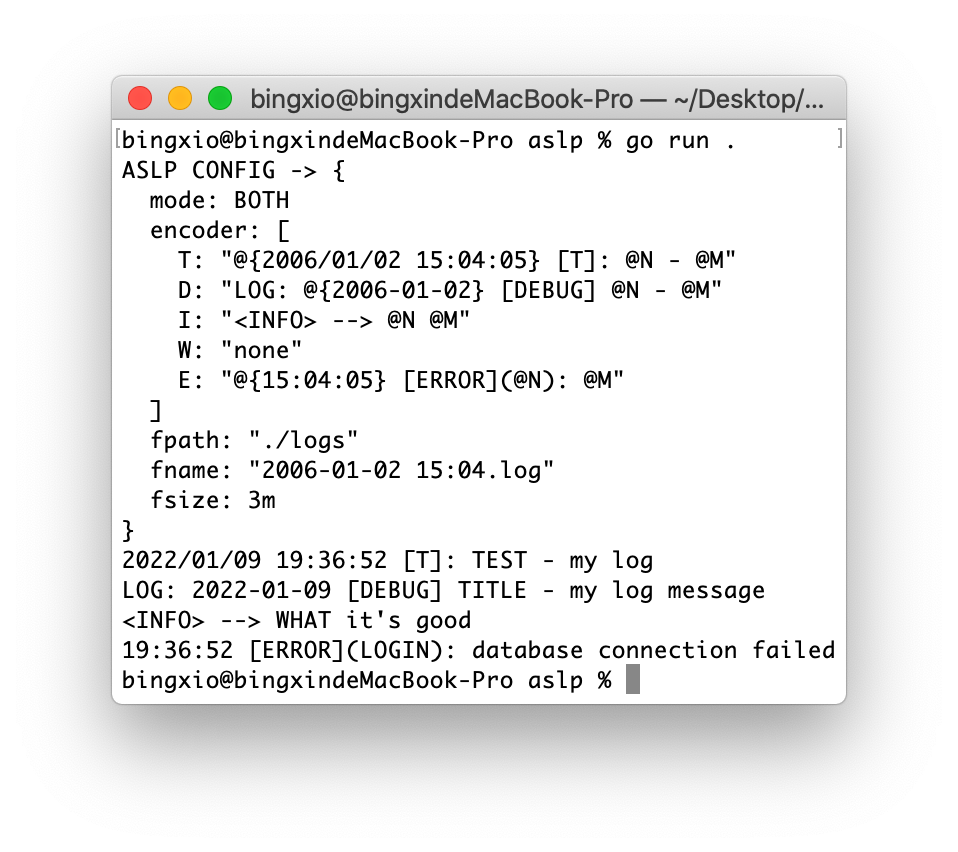

# ASLP
A Go language based log library, simple, convenient and concise.
- Three modes, standard output, file mode and common mode.
- Convenient, simple and not complicated.
## Use
Create a configuration structure that receives two parameters, mode and custom log format.
```go
conf := NewConfig(
        Both,
        Encoder{
                T: "@{2006/01/02 15:04:05} [T]: @N - @M",
                D: "LOG: @{2006-01-02} [DEBUG] @N - @M",
                I: "<INFO> --> @N @M",
                W: "",
                E: "@{15:04:05} [ERROR](@N): @M",
        },
)
conf.Dissemble()
```
You only need to fill stdout for output, file for file mode, and both for both mode.
For file mode or both mode, you need to specify the detailed configuration of log files.
```go
conf.FileName = "2006-01-02 15:04"
conf.FileSize = 3
conf.Fpath = "./logs"
```
Create a log structure, and then use the specified method of the log to set the log.
```go
l, err := NewLog(&conf)
if err != nil {
        panic(err)
}
```
Module and content.
```go
l.T("TEST", "my log")
l.D("TITLE", "my log message")
l.I("WHAT", "it's good")
l.E("LOGIN", "database connection failed")
```
Check the output and log files.
## Syntax
Customize the log format in the configuration structure. Currently, three variables are supported.
```
@{2006-01-02 15:04:05}  -> Curly braces wrap in time format
@N                      -> Module name
@M                      -> Log content
```
## Install
## Donate
Thank you for your charity, my meal money, support for Alipay and WeChat.


<div style="float: left">
        
        
</div>

## License
```
// Copyright 2021 bingxio. All rights reserved.
//
// Gnu Public License v3
// license that can be found in the LICENSE file.
//

// ASLP
// A Go language based log library, simple, convenient and concise.
```
